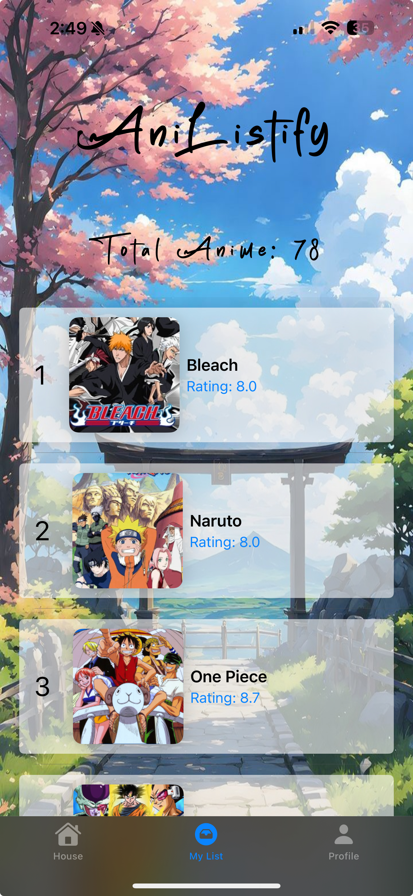

# AniListify

AniListify is a SwiftUI-based iOS app that allows users to search, track, and manage their favorite anime. Built using modern technologies like SwiftUI and Firebase, AniListify integrates the Jikan API to provide real-time anime data.

---

## 📱 Features

- **Search Anime**: Search for your favorite anime titles using the Jikan API.
- **Add Anime to List**: Keep track of anime you love by adding them to your personalized list.
- **Manage Anime List**: View, Ranking ,update, and delete items from your anime list.
- **Anime Info: Let user to view the anime selected information such as Ranking,Description in new sheet.
- **User Authentication**: Sign up, log in, and manage your profile with Firebase Authentication.
- **Persistent Storage**: Save and sync your anime list using Firestore.

## 🎨 Screenshots 

### Login Screen 

## Register Screen

## Home Screen

## Search Results

## List Screen

## Profile Screen

## 🔧 Technologies Used

-**SwiftUI**: For a modern , declarative UI design.
-**Firebase**:
-Authentication: User login and registration
-Firestore: Cloud database for storing user anime lists.
-**Jikan API**: Provides real-time anime data

## 🌐 API Refernce

### Jikan API
- **Base URL**: "http/api.jikan.moe/v4"
- **Endpoints used**:
- **Search Anime**: '/anime?q=(query)'

##Example API Call**:
'''bash 
GET http://api.jikan.moe/v4/anime?q=naruto

##  📝 License
AniListIfy is licensed under the MIT License. see the LICENSE file for details.

## 👨‍💻 Author
Developed by Itzhak Rouach  
Contact with me:  
- **GitHub**: ItzhakRouach.
- **Email**: Tzachiruash12345@gmail.com

##  Acknowledgements
- **Jikan API** for providing real-time anime data.
- **Firebase** for user authentication and data storage.
